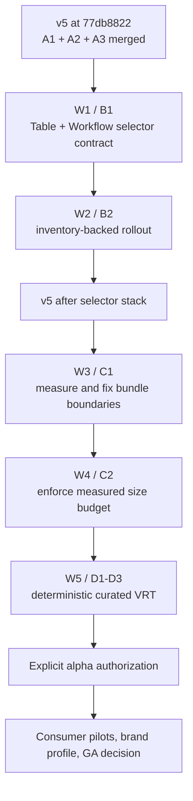

# Roadmap — v5 post-A3 release-readiness work

## Identity and operating contract

- Date: 2026-08-02
- Status: roadmap committed; W1 is prepared but paused at an explicit public
  API naming gate discovered by the delegated executor and confirmed by Sol.
- Repository: `uzh-bf/design-system`
- Release trunk: `v5` (long-lived branch and final merge target).
- Current base: `origin/v5` at `77db88226e8c2fd14a59ca4e73ae869b5499a43d`, the
  squash merge of PR #189 (A3 composite refs).
- Working branch: `rs/v5-test-selector-contract`
- Working directory: `trees/rs-v5-test-selector-contract`
- Audience: a fresh executor (Kimi) must be able to implement W1 from this
  file without relying on chat history. The orchestrator owns integration,
  review, verification, publication, and landing.
- Predecessors: `project/2026-07-18-v5-production-readiness-roadmap.md`, the
  2026-08-01 release-readiness stack roadmap, and the merged A1/A2/A3 plan
  files. The A3 source plan is `project/2026-08-02-v5-composite-refs-plan.md`.

This roadmap is a new post-A3 execution artifact. It does not rewrite the
older plans or turn the release trunk into a stack layer.

## Current state, verified before implementation

| Surface | Verified state | Consequence |
| --- | --- | --- |
| v5 | `origin/v5` is `77db8822` and contains the merged A1/A2/A3 public-contract work | All new branches start from this exact ref. |
| A3 | PR #189 is merged into v5; its source branch was auto-deleted | Do not reuse or recreate the old A3 PR. |
| main | `origin/main` remains separate | Never merge v5 into main and never target main from this roadmap. |
| v5 PR queue | No open PR currently targets v5 | W1 can be a standalone draft PR; W2 may later depend on it. |
| stack tooling | GitHub native stack capability is available, but no current branch is in a live stack | Do not invent stack metadata. Use a normal standalone W1 PR unless a later approved topology requires a native child. |
| repository visibility | GitHub reports the repository as public; no submodules or project Kimi agent definitions were found | A bounded public-OSS Kimi implementation is eligible. |
| Kimi runtime | `kimi` 0.31.1 is installed and the `kimi-executor` role/model routing smoke-tested successfully | Kimi may edit only the named W1 scope; it has no push, merge, release, or publication authority. |
| local worktree | The root checkout is stale and has unrelated `.pnpm-store/` plus an untracked prior roadmap | Keep root untouched. Use the clean `trees/rs-v5-test-selector-contract` worktree. |
| CI contract coverage | CI runs `tests/smoke` and `tests/a11y`; files under `tests/contracts` are useful local fixtures but are not enforced by the current CI jobs | Put the W1 runtime selector proof under `tests/smoke`; keep type fixtures under the existing contract-type setup. |

## Non-negotiable boundaries

1. `v5` is the only target branch. There must be no merge, rebase, PR, or
   promotion from v5 into `main` or another release line.
2. W1 is a selector-contract change, not a general test migration. Do not add
   refs, theme changes, visual redesigns, bundle changes, Formik work, export
   changes, new dependencies, or unrelated cleanup.
3. The supported selector value shape is exactly `{ cy?: string; test?:
   string }`, rendered as `data-cy` and `data-test`. Do not introduce or
   preserve a new `data-testid` convention in W1. The Table prop name remains
   gated below because Table already uses `data` for its row collection.
4. Preserve semantic names for independently addressable controls only when
   each value uses the same shape. Do not collapse a multi-control API into a
   single ambiguous selector.
5. Do not publish an alpha, create a tag, start a consumer pilot, or claim GA
   readiness. Those are separate approval gates after the engineering stacks.
6. Kimi must not push, create/update a PR, mark a PR ready, merge, delete
   branches/worktrees, deploy, or access secrets. It may edit and locally test
   only the bounded W1 files below.
7. Any scope ambiguity, source drift, failed contract, or required API change
   outside W1 is a stop-and-report condition, not an invitation to widen the
   slice.

## Target topology

The next work is Stack B from the release-readiness sequence. It is deliberately
split so the public contract is proven before a broad retrofit:



W1 is one cohesive normal PR rooted at v5. It is not a child of an old A3
branch, and v5 itself is never a PR or stack layer. W2 is blocked until W1 is
merged and its public value shape is accepted. If native stack metadata is used
for W2 later, initialize it explicitly with base `v5`; never rely on the CLI's
local default (which can resolve to `main`).

## Detailed work packages

### W0 — freshness and plan commit (this branch)

Purpose: make the exact implementation contract travel with the code.

Actions:

- Keep this plan as the first commit on `rs/v5-test-selector-contract`.
- Before Kimi starts, re-check `git rev-parse HEAD`, `git rev-parse
  origin/v5`, branch/worktree ownership, and the absence of open competing PRs.
- Run a staged data-hygiene review before committing the plan. The plan must
  contain no credentials, tokens, private URLs, customer data, or raw exports.

Ready when: the plan is committed on the clean v5-based branch and the branch
still points at `77db8822` before implementation edits begin.

### W1 — selector contract proof (current execution slice)

Purpose: prove the public shape on the two highest-value acceptance components
before inventory-driven rollout.

#### Public contract

Use the existing inline shape rather than adding a shared abstraction:

```ts
data?: {
  cy?: string
  test?: string
}
```

- `Table`: its current public props are `data: RowType[]` (rows) and
  `dataAttributes: { cy?: string; test?: string }` (selector). A literal
  `dataAttributes` → `data` rename cannot compile while the row prop remains
  named `data`. This is a decision gate, not an executor guess:

  | Option | Result | Recommendation |
  | --- | --- | --- |
  | A — rename rows to `rows` and selectors to `data` together | One coherent selector vocabulary, but a second breaking Table API rename; requires every in-repository Table call site and migration example to change | Recommended only if the user explicitly accepts the wider v5 break |
  | B — keep Table's `dataAttributes` for now and implement Workflow's item-level `data` | Smallest safe PR, but the public selector vocabulary remains inconsistent and Table becomes a follow-up | Safe fallback if the wider Table break is not approved |
  | C — use another selector name on Table | Avoids the collision but creates a third public convention | Reject |

  Do not implement A or silently choose B until the ruling is recorded. Under
  option A, keep selector attributes on the existing outer root; this root is
  the stable table selector and sortable header buttons remain discoverable by
  role rather than receiving an ad-hoc second selector API.
- `Workflow`: each step is an independently actionable button. Add the same
  optional `data` value to the step item shape and render its `data-cy` and
  `data-test` on that step's actual `<button>` in both tooltip and non-tooltip
  paths. Do not put a step selector on the decorative `<li>` or Tooltip wrapper,
  and do not add a misleading single selector to the `<ol>` root.
- Keep the `data` value optional and preserve the existing item object passed
  to `onClick`. Both `Workflow` and `WorkflowProgress` must support the same
  item-level selector contract.
- Do not add `data-testid`, spread arbitrary records, or change unrelated
  attribute forwarding.

#### Owned files for Kimi

Kimi may edit only these paths (plus the new focused test/fixture files if
needed by the repository's existing contract-test convention):

- `packages/design-system/src/Table.tsx`
- `packages/design-system/src/Table.stories.mdx`
- `packages/design-system/src/Workflow.tsx`
- `packages/design-system/src/Workflow.stories.mdx`
- `packages/design-system/src/PublicContracts.stories.mdx` for the focused
  Ladle fixture (extend the existing contract story; do not create a second
  generic test page)
- `packages/design-system/tests/smoke/test-selectors.spec.ts`
- `packages/design-system/tests/contracts/test-selectors.types.ts`
- `packages/design-system/tests/contracts/composite-refs.types.ts` only if
  option A requires updating existing Table call-site type fixtures
- `packages/design-system/tsconfig.types.json` only if the type fixture needs
  an existing project include adjustment
- `packages/design-system/MIGRATION.md` for the `dataAttributes` → `data`
  migration entry

Do not edit the plan, package metadata, CI, unrelated stories, deprecated
Formik modules, or the broader selector inventory in W1.

#### Required W1 proof

1. After the Table gate is resolved, the existing `PublicContracts.stories.mdx`
   contract story renders the approved Table shape and a
   Workflow/WorkflowProgress with distinct per-step selectors.
2. The focused Playwright test asserts the attributes on the Table root and on
   the actual Workflow step buttons, including the tooltip branch. It must also
   assert that a disabled step remains the selector-bearing button rather than
   a wrapper.
3. A type fixture accepts the exact `cy`/`test` shape and rejects arbitrary
   keys (especially `data-testid`). If option A is approved, it also rejects
   the removed Table `dataAttributes` prop and row arrays passed through
   `Table.data`; if option B is chosen, the Table assertion remains a tracked
   follow-up instead of being faked.
4. Existing keyboard and accessibility behavior remains intact: Workflow
   buttons remain focusable, disabled steps retain `aria-disabled`, and Table
   sorting/`aria-sort` behavior is unchanged.
5. Story prose and migration prose use the new shape and contain no stale
   `dataAttributes` instructions for Table.

#### W1 acceptance gate

W1 is ready for orchestrator review only when the diff is limited to the owned
   paths, the attributes are attached to the intended DOM controls, all focused
   checks pass, and no `data-testid` or arbitrary-record escape hatch was added.
   A change that requires touching more components is W2, not a W1 extension.

### W2 — inventory-backed selector rollout (future, gated on W1)

Build a current inventory from source, stories, and public examples. Classify
each interactive component as primary-only, multiple-control, or intentionally
non-interactive. Retrofit only the approved public set:

- migrate remaining `dataAttributes`, `dataX`, and `Record<string, string>`
  forms to the same `{ cy, test }` value shape;
- retain named sub-element props for Modal, picker popovers, and similar
  multi-control components only when their values use that shape;
- update stories and `MIGRATION.md` with before/after examples;
- add inventory-backed DOM contracts, not a global search-and-replace;
- leave deprecated Formik components, passive layout components, and unrelated
  consumer examples out unless a separately approved package policy changes.

W2 cannot start until W1's location and naming contract is reviewed and merged.

### W3 — measured bundle boundaries (future)

Capture a reproducible baseline for package build output, compressed sizes,
large-chunk dependency membership, tarball contents, and peer-runtime markers.
Then make the smallest measured Vite graph change so generic imports do not
pull heavy date/chart/carousel dependencies. Preserve root, primitives, CSS,
and preflight exports. Do not set thresholds before recording the baseline.

### W4 — enforce the bundle budget (future)

Use the installed size-limit tooling only after W3 has measured a useful
boundary. Add the smallest CI gate that protects that boundary and the publish
job's existing lint/format/build prerequisites. This remains blocked while
alpha publication is held.

### W5 — deterministic visual evidence (future)

Split the visual work into three independently reviewable layers:

- D1: pinned container, self-hosted fonts, reduced motion, one Button canary,
  and two repeated zero-diff runs. Host-generated screenshots are not
  baselines.
- D2: curated 15-component neutral/UZH desktop set, manually inspected and
  generated in the same container.
- D3: the identical container in CI with actual/diff artifacts, initially
  report-only until stability evidence supports a later blocking decision.

### W6 — release and consumer gates (future and separately authorised)

Keep the later sequence explicit:

- E1: request explicit alpha authorization, then publish and verify package
  resolution;
- E2: run the GBL preview pilot in its own repository, including React dedupe
  and `transpilePackages` evidence;
- E3: implement the already-approved D8 supported primary-ramp override
  contract;
- E4: document that profile, migration corrections, and a Klicker acceptance
  fixture;
- E5: publish a newer alpha containing E3/E4; the earlier alpha cannot prove
  later brand-profile code;
- E6: run the Klicker migration pilot against that newer alpha;
- E7: re-run final package, consumer, maintainability, and bounded security
  gates, then request separate `v5.0.0`/`latest` authority.

No item in W6 is authorized by this roadmap.

## Verification matrix

The orchestrator, not Kimi's report, is the source of truth for completion.

### Kimi's bounded local checks

- changed-file Prettier check;
- changed-file ESLint with zero warnings;
- the new focused selector Playwright contract (using the existing Ladle
  harness and `PWTEST_SKIP_BUILD=1` only when a fresh local build is already
  verified);
- the focused type fixture through the repository's existing type-check
  script, if it is wired by the current package configuration.

### Orchestrator checks before accepting the diff

- inspect `git status`, `git diff --stat`, and the full diff against
  `77db8822`; reject unrelated files or generated artifacts;
- `pnpm --dir packages/design-system check`;
- package type declarations (`tsc -p tsconfig.types.json --noEmit` or the
  repository-native equivalent);
- package build and Ladle build;
- focused selector contract plus existing Table keyboard and Workflow keyboard
  contracts;
- full `pnpm --dir packages/design-system test:a11y`;
- package smoke/consumer import checks if any public export or generated type
  changes unexpectedly;
- `git diff --cached` data-hygiene review before committing.

If pnpm's local signature wrapper fails, record the exact error and use the
repository's installed package-manager binary or CI-equivalent command. Do not
upgrade dependencies or work around the failure with a new tool.

### Review gates

After the implementation is committed, obtain an exact-range trusted code
review and simplification pass. At final close-out, run the mandatory
thermo-nuclear maintainability review and bounded code-level security review.
Kimi's output is advisory implementation work and can never be the sole final
review. Publication and PR readiness remain orchestrator/user decisions.

## Stop conditions and traps

- `origin/v5` moves before W1 begins: stop, refresh the branch, and update this
  plan's base rather than silently rebasing.
- The local root has unrelated changes: never stage or clean them.
- A selector lands on an `<li>`, Tooltip wrapper, decorative root, or other
  non-interactive element: reject and ask for correction.
- A component needs arbitrary prop spreading, `data-testid`, visual changes,
  or broad inventory edits to finish: stop at W1 and record the follow-up.
- A test passes because the story failed open, did not mount, or queried an
  empty fallback: inspect the producing Ladle run and counters before calling
  it evidence.
- Existing MDX examples contain stale conventions outside the owned files:
  record them for W2; do not sweep them into W1.
- Any request to push, open/ready a PR, merge, tag, publish, or clean a
  worktree requires explicit authority outside Kimi's execution brief.

## Progress (append-only)

- 2026-08-02: re-verified `origin/v5` at `77db8822` after PR #189 merged; v5
  remains the sole release trunk and main remains untouched.
- 2026-08-02: confirmed the repository is public, has no submodules or local
  Kimi agent overrides, and the Kimi executor routing smoke test succeeded.
- 2026-08-02: created isolated worktree `trees/rs-v5-test-selector-contract`
  from `origin/v5`; root worktree changes were left untouched.
- 2026-08-02: selected W1/B1 as the next bounded execution slice: Table's
  `dataAttributes` rename and Workflow's per-step selector contract, with W2
  inventory rollout held behind the W1 acceptance gate.
- 2026-08-02: Sol's independent roadmap review found that the planned Table
  rename collides with its existing required `data: RowType[]` row prop and
  that `tests/contracts` is not CI-enforced. Kimi was stopped before editing;
  W1 now awaits the explicit Table naming ruling and will place runtime proof
  under `tests/smoke`.
