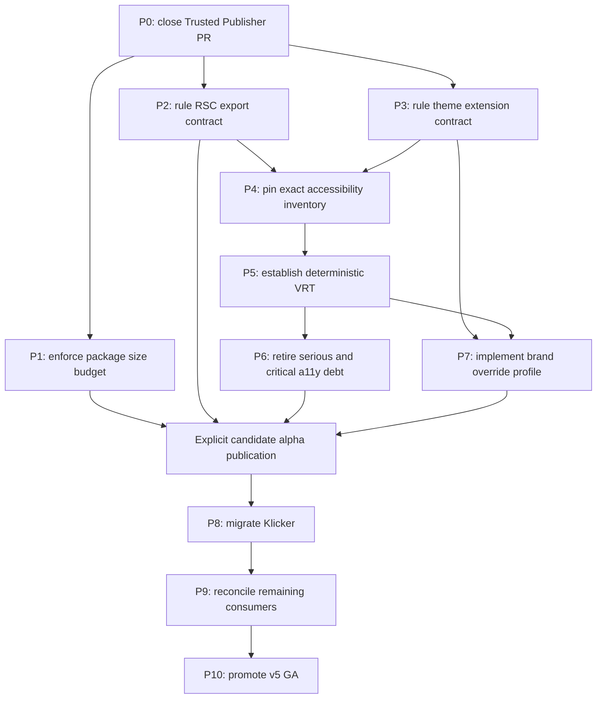

# Roadmap — Design System v5 GA readiness

## Identity and status

- Date: 2026-08-10
- Status: approved roadmap; P0 is executing in draft PR
  [#195](https://github.com/uzh-bf/design-system/pull/195).
- Repository: `uzh-bf/design-system`
- Release trunk: `v5`
- Roadmap branch: `rs/ci-npm-trusted-publisher`
- Roadmap worktree:
  `/Users/rschlae/Git/df/design-system/trees/rs-ci-npm-trusted-publisher`
- First delivery: PR #195 into `v5`; merge remains separately authorized.
- Audience: maintainers and future execution agents preparing v5 for GA and
  migrating the first production consumers.

## Goal

Move v5 from a registry-proven prototype release to a GA candidate with an
immutable release boundary, enforced package budgets, deterministic visual and
accessibility gates, explicit React Server Components and theme-extension
contracts, a reviewed Klicker brand profile, and representative real-application
proof.

## Non-goals

- This roadmap does not authorize a merge, tag, package publication,
  deployment, or consumer delivery.
- PR #195 does not implement the post-P0 work packages.
- GA does not require every known consumer to complete a full migration. It
  requires a current compatibility matrix with no unknown critical break and
  representative VetSim, GBL demo-game, and Klicker evidence.
- Formik compatibility exports are not removed without a separate consumer
  inventory and semver ruling.
- No brand ramp, accessibility count, package budget, or visual threshold is
  invented before it is measured or approved.

## Source-of-truth rules

1. This roadmap supersedes the status, ordering, milestones, and GA criteria in
   the historical production-readiness, post-A3, and prototype-readiness
   roadmaps. Those files remain evidence for completed packages and are not
   rewritten to simulate current state.
2. Code, Git history, CI runs, npm registry readback, packed artifacts, and
   consumer builds outrank status prose.
3. Every future Design System or consumer PR receives its own reviewed
   execution plan. This roadmap controls milestone order and gates; it does not
   replace package-level plans.
4. Accepted ADRs own durable public contracts. A change to the two-door public
   API must first supersede `docs/adr/0001-two-door-public-api.md`.
5. PR [#179](https://github.com/uzh-bf/design-system/pull/179) is the existing
   `v5 -> main` promotion boundary. It is not a source branch for feature work
   and is not replaced merely because it is broad or stale.
6. Push, PR creation, PR readiness, merge, tag creation, tag push/publication,
   dist-tag promotion, and deployment remain distinct authority gates.

Historical inputs:

- `project/2026-07-18-v5-production-readiness-roadmap.md`
- `project/2026-08-02-v5-post-a3-next-roadmap.md`
- `project/2026-08-05-v5-prototype-readiness-roadmap.md`
- `project/2026-08-09-v5-rhf-w3-plan.md`
- `project/2026-08-10-pr-195-ci-npm-trusted-publisher-plan.md`
- GBL evidence:
  `/Users/rschlae/Git/gbl/gbl-uzh/trees/rs-v5-alpha-pilot/project/2026-08-09-v5-gbl-w3-plan.md`

## Planning and routing

- The user approved the PR #195 closeout and requested this detailed roadmap.
- `rs-sliced-development-workflow` owns package plans, slice commits,
  verification, review, and PR finish.
- `writing-for-agents` keeps each work package executable without chat history.
- The configured planner completed a read-only planning-stage pass with
  `DONE_WITH_CONCERNS`. Its three concerns are retained as explicit gates:
  React Server Components export design, Klicker brand-ramp ownership, and the
  inconsistent accessibility baseline count.
- Security-sensitive release changes, public API rulings, architecture,
  integration, and external side effects remain in the main session. Bounded
  implementation may be delegated only after a package plan fixes its paths,
  behavior, and checks.
- No broad external research was required for P0. The action pins were resolved
  from the upstream Git tag refs. Later packages must use their official tool
  documentation when selecting Size Limit or Playwright configuration.

## Current milestone state

| Milestone                           | Status                                 | Evidence and next gate                                                                                                                                                                                               |
| ----------------------------------- | -------------------------------------- | -------------------------------------------------------------------------------------------------------------------------------------------------------------------------------------------------------------------- |
| v5 engineering through RHF wrappers | Complete                               | PRs #180-#194 are in remote `v5` at `1de22ddc`; alpha.3 contains the four RHF wrappers.                                                                                                                              |
| Alpha.3 publication                 | Complete                               | npm `alpha` resolves to `5.0.0-alpha.3`; `latest` remains `4.1.6`; Trusted Publisher replay run `31364726904` passed.                                                                                                |
| VetSim consumer pilot               | Complete and merged                    | VetSim PR [#18](https://github.com/rschlaefli/vet-platform/pull/18) and hover correction [#19](https://github.com/rschlaefli/vet-platform/pull/19) merged.                                                           |
| GBL demo-game pilot                 | Implementation complete; delivery held | Clean local branch `rs/v5-alpha-pilot` at `9f8c76b`, five commits ahead of `origin/dev`; final verification and review passed.                                                                                       |
| Trusted Publisher PR                | P0 source complete; live CI gate       | PR [#195](https://github.com/uzh-bf/design-system/pull/195) is draft; replay proof is green; action pins, complete prerequisites, dispatch removal, read-only permissions, and required source reviews are complete. |
| Package size gate                   | Not started                            | Size Limit dependencies exist, but no script, configuration, threshold, or CI gate exists.                                                                                                                           |
| Accessibility retirement            | Ratchet active; inventory uncertain    | The allowlist header says 190 serious/critical rule-cases, while its itemized reason counts sum to 159. Re-measure before claiming either count.                                                                     |
| Deterministic VRT                   | Not started                            | Playwright and self-hosted fonts exist; no `tests/visual` suite or committed baseline exists.                                                                                                                        |
| Consumer contracts                  | Decision required                      | VetSim exposed a root-barrel RSC incompatibility and theme-token ownership/cascade friction.                                                                                                                         |
| Brand override and Klicker          | Not started                            | D8 gives a direction, but the complete approved ramp, ownership, profile, and consumer migration do not exist.                                                                                                       |
| GA promotion                        | Held                                   | PR #179 is draft and spans 170 commits and 275 files; its current checks are not fresh GA evidence.                                                                                                                  |

## Dependency sequence

P1, P2, and P3 may be planned independently after P0, but each remains a
separate PR. P4 establishes the trustworthy accessibility denominator before
repair work. P5 protects later visual fixes. P7 waits for the theme contract
and visual foundation. Klicker consumes a separately authorized candidate
alpha containing P1-P7.

## Test portfolio

| Consequential risk                                                   | Existing protection                             | Test obligation                                     | Primary seam                                      | Distinct failure caught                                           | Owner |
| -------------------------------------------------------------------- | ----------------------------------------------- | --------------------------------------------------- | ------------------------------------------------- | ----------------------------------------------------------------- | ----- |
| Privileged release code changes under a mutable tag                  | Successful alpha.3 replay and tag/version guard | Extend existing CI evidence; no new test file       | Workflow action refs and job graph                | Upstream tag retarget or publish despite lint/format failure      | P0    |
| Generic import regresses into heavy dependency graph                 | W3 esbuild/Vite packed-consumer measurements    | Add a hard built-package budget                     | Named root/primitives consumer bundles            | Button import silently absorbs date/chart/carousel code           | P1    |
| Root composite import fails in a Server Component                    | VetSim client wrapper workaround                | Add packed Next App Router integration              | `react-server` resolution of root and RHF entry   | Root resolves client-only RHF symbols                             | P2    |
| Theme or app variables override each other unpredictably             | VetSim aliases and current Ladle themes         | Extend computed-token and consumer fixture coverage | Document-root theme plus app-prefixed variables   | UZH primary/destructive tokens resolve neutral or unreadable      | P3    |
| Accessibility debt count is stale or fail-open                       | Four-shard axe ratchet and harness canary       | Replace broad prose count with exact inventory      | `(rule, story, theme)` report                     | Empty scan or regex waiver absorbs new debt                       | P4    |
| Visual output changes without review                                 | Manual historical screenshots only              | Add deterministic snapshot seam                     | Digest-pinned Playwright container                | Theme/component appearance changes with no diff artifact          | P5    |
| Known serious/critical accessibility defects ship into GA            | Current allowlist                               | Remove every waiver with its owning fix             | Axe plus focused keyboard/label/browser contracts | Known inaccessible semantics survive GA                           | P6    |
| Brand profile applies only one color and breaks focus/sidebar states | D8 direction and VetSim experience              | Extend theme contract and VRT                       | Complete approved profile                         | Primary ramp, ring, sidebar, or contrast diverges                 | P7    |
| Real consumer cannot install/build/run candidate                     | VetSim and GBL proof                            | Extend application-native journeys                  | Klicker package/build/browser boundaries          | Package contract works in fixtures but fails in the main consumer | P8    |
| Older consumers hide a critical compatibility break                  | Historical source audits                        | Extend each consumer's existing build/browser seam  | Per-repository packed-candidate probe             | Unknown critical break remains at GA                              | P9    |
| Promotion uses stale checks or wrong package metadata                | Alpha release guard and registry readback       | Rerun established portfolio; no promotion-only test | PR #179, tag/version mapping, registry dry run    | Wrong commit/version/dist-tag is promoted                         | P10   |

## Work packages

### P0 — Close PR #195 safely

- Problem: The publish job has OIDC and package-write permission while using
  mutable action tags, and publication does not wait for lint or formatting.
- Evidence: `.github/workflows/main.yml` grants `id-token: write` and
  `packages: write` to `publish`; `build` currently needs only TypeScript,
  tests, and a11y; live PR review identified the mutable references.
- Decision: Preserve the already-proven v4 behavior and pin only actions inside
  the privileged `publish` job to the exact commits currently selected by
  their upstream v4 tags:
  - `actions/checkout@11d5960a326750d5838078e36cf38b85af677262`
    (`v4.4.0`)
  - `actions/setup-node@49933ea5288caeca8642d1e84afbd3f7d6820020`
    (`v4.4.0`)
  - `pnpm/action-setup@b906affcce14559ad1aafd4ab0e942779e9f58b1`
    (`v4.3.0`, the commit currently selected by `v4`)
  - both `JS-DevTools/npm-publish` uses at
    `0fd2f4369c5d6bcfcde6091a7c527d810b9b5c3f` (`v4.1.5`)
- Decision: Make `build` depend on `lint` and `check-format` as well as
  `check-ts`, `test`, and `a11y`. The publish job continues to depend only on
  `build`, so that job becomes the complete release prerequisite gate.
- Decision: Remove the one-time alpha.3 `workflow_dispatch` path after its
  successful replay. Keep normal version-tag pushes as the only publication
  trigger. Set workflow-level permissions to `contents: read`; let only the
  publish job add OIDC and package-write permissions.
- Risk: Pinning an annotated tag object instead of its peeled commit; changing
  unrelated CI jobs; implying that plan or PR completion authorizes merge.
- Do:
  1. Pin the four privileged-job actions with version comments.
  2. Add lint and formatting to the build prerequisite list.
  3. Remove the one-time manual replay input and branch-dispatch publish path.
  4. Set the workflow-wide read-only permission baseline.
  5. Add this roadmap and close PR #195's execution plan with current GBL and
     registry evidence.
  6. Run required security, maintainability, and integrated final reviews on
     the exact final range.
  7. Push the existing branch, update the draft PR body, and wait for CI.
- Check: YAML parse; full-SHA/action-comment inspection; `git diff --check`;
  no `NPM_TOKEN`; no `workflow_dispatch`; workflow-level `contents: read`;
  publish-only OIDC/package-write; all PR checks green. Do not replay alpha.3
  again because that immutable version is already published.
- Test obligation: Extend existing workflow/CI evidence; no new test file.
- Delivery boundary: Existing branch and draft PR only. Push/update is
  authorized. Merge, readiness, tag, publication, and deployment are held.
- Commit shape: metadata rename; roadmap commit; `ci(release): pin privileged
publish actions`; final progress/review commit.
- Stop: A resolved SHA does not match the documented release; GitHub checks a
  different ref; the fix changes release semantics; any secret value appears.

### P1 — Enforce package-size budgets

- Problem: W3 proved better bundle boundaries, but the installed Size Limit
  tooling is inert and cannot block a regression.
- Evidence: Root `package.json` installs `size-limit` and its big-library
  preset; no repository script or configuration consumes them.
- Decision: Gate public import seams, not generated module count or the total
  package tarball alone. Measure before choosing thresholds and use explicit
  headroom. Avoid execution-time metrics that vary by runner.
- Risk: A webpack-oriented measurement protects a different contract from the
  earlier Vite/esbuild probe; thresholds are copied from historical values;
  heavy positive controls are accidentally optimized away.
- Do: Add the package-level plan, measure root `Button`, primitives `Button`,
  CSS/preflight, and representative Calendar/Chart/Carousel positive controls;
  add configuration and a root script; run it after the package build; wire it
  into CI before publication.
- Check: Current baseline passes; a temporary lower threshold in `/private/tmp`
  fails; generic imports show no date/chart/carousel contribution; positive
  controls retain their intended dependency; packed exports still resolve.
- Test obligation: Add a new built-package budget contract.
- Delivery boundary: One full-path DS PR from current `origin/v5`; no tag or
  publication.
- Commit shape: plan; `build(size): enforce v5 package budgets`; CI wiring;
  final progress/review.
- Stop: No reproducible baseline, undeclared runtime import, package export
  drift, or threshold selected before evidence.

### P2 — Rule and implement the React Server Components contract

- Problem: The root barrel re-exports `Form` and RHF wrappers, so a Server
  Component import can reach React Hook Form's reduced `react-server` export.
  VetSim needed a client wrapper even when importing an unrelated root control.
- Evidence: VetSim PR #18 documents the workaround; root `src/index.ts` exports
  `Form` and `Rhf*`; ADR 0001 deliberately made RHF a required root peer.
- Recommendation: Keep the root server-importable and move RHF integration to
  a dedicated `./react-hook-form` client entry. This supersedes ADR 0001 and is
  a pre-GA breaking change, not a compatibility alias.
- Required ruling: Approve the dedicated subpath, or explicitly accept that
  the v5 root is client-only and every Server Component consumer needs a client
  wrapper. No implementation begins before this decision.
- Risk: Incomplete removal of runtime RHF edges; declarations still pull the
  wrong condition; a type-only fixture misses the real `react-server` resolver;
  consumers migrate to another temporary path.
- Do after ruling: Write/supersede the ADR; add the entry source, build input,
  exports and declarations; move RHF integration exports; update migration
  docs and consumer examples.
- Check: Pack the artifact; build a minimal Next App Router fixture whose
  Server Component imports a non-form root composite and whose client leaf
  imports `./react-hook-form`; verify root runtime/declarations do not resolve
  RHF's client-only symbols.
- Test obligation: Add packed Next/RSC integration; extend existing RHF type
  contracts at the new path.
- Delivery boundary: One full-path DS PR with one intermediate public-contract
  review; candidate alpha publication is separate.
- Commit shape: ADR and plan; export/build split; fixture/docs; final evidence.
- Stop: No user ruling, unplanned compatibility shim, unresolved RSC failure,
  or conflict with an accepted ADR.

### P3 — Rule the theme cascade and extension contract

- Problem: VetSim had to alias generic variables because DS/shadcn tokens and
  application semantic variables shared names and import-order ownership was
  unclear. The proof does not yet distinguish an actual UZH cascade bug from a
  consumer namespace collision.
- Evidence: VetSim PR #18 records aliases for `--primary`, `--accent`, and
  `--destructive`; v5 declares generic shadcn bridge variables and
  `[data-theme='uzh']` mappings.
- Decision: Reproduce before changing CSS. DS owns its documented generic
  shadcn bridge tokens. Applications use an app prefix for their own semantic
  variables. If the minimal fixture proves UZH tokens are neutralized by DS
  source order, fix that cascade in DS rather than documenting an app override.
- Risk: Renaming the whole shadcn token namespace creates unnecessary churn;
  documentation hides a real source-order defect; scoped themes and portals are
  conflated with document-root behavior.
- Do: Build a packed-artifact fixture for neutral and UZH document-root themes;
  record computed variables before/after consumer CSS; rule ownership and
  import order; fix only the reproduced DS defect; document the extension
  contract and app-prefix requirement.
- Check: Computed-token assertions; representative Button/Badge/focus/sidebar
  rendering; neutral and UZH Ladle/browser proof; packed CSS import-order test.
- Test obligation: Extend theme contract tests; add one packed consumer
  cascade fixture only if it catches the reproduced failure.
- Delivery boundary: One DS contract PR; no brand profile yet.
- Commit shape: plan/evidence; minimal CSS or docs contract; fixture; final
  review.
- Stop: Reproduction does not isolate ownership, fix breaks neutral/UZH, or
  profile-specific design is needed.

### P4 — Pin the exact accessibility inventory

- Problem: The blocking ratchet works, but its header claims 190 waived
  serious/critical rule-cases while the itemized reason counts sum to 159.
- Evidence: `packages/design-system/tests/a11y/stories.spec.ts` contains both
  statements; the last complete historical run reported 190.
- Decision: Treat both counts as untrusted until a fresh run emits a complete
  `(rule, story, theme)` inventory. Replace regex-only count prose with an exact
  generated/checked inventory that fails on unexplained drift.
- Risk: Empty-page or incomplete-story output looks green; story-fixture debt
  is mixed with component debt; a broad waiver absorbs new stories.
- Do: Run all four shards against built Ladle; reconcile output to stories and
  themes; persist exact cases in the narrowest maintainable form; retain the
  harness canary; classify fixture versus component ownership.
- Check: Two matching complete runs; expected story/theme cardinality;
  canary proves the scan mounted content; changing one expected case makes the
  inventory check fail.
- Test obligation: Replace/consolidate the broad baseline representation;
  preserve the existing gate.
- Delivery boundary: One test-only full-path PR; no bulk component fixes.
- Commit shape: plan; `test(a11y): pin exact serious-critical baseline`; final
  evidence.
- Stop: Count drift is unexplained, output is empty/partial, or CI and local
  runners enumerate different stories.

### P5 — Establish deterministic visual regression testing

- Problem: Neither theme has automated visual protection.
- Evidence: Playwright and self-hosted fonts exist; the 2026-06-15 VRT plan is
  unimplemented; no `tests/visual` or `toHaveScreenshot` usage exists.
- Decision: Use Playwright native snapshots in a digest-pinned Playwright
  container matching the repository version. Start with report-only CI and
  make it blocking only after repeated zero-diff evidence.
- Risk: Host-generated baselines, dynamic time/animation, binary growth, loose
  thresholds hiding real change, or automatic baseline updates.
- Do: Resolve and record the container digest; add a two-theme Button canary;
  run it twice with zero diff; add the curated 15-component desktop set;
  freeze time and motion; review PNGs; upload actual/diff artifacts in CI.
- Check: Every baseline is generated and compared in the same container
  digest; two local container runs and two CI runs are clean; manual review
  confirms each image covers a meaningful state.
- Test obligation: Add a new stable visual seam.
- Delivery boundary: Foundation/report-only PR, followed by a small separate
  CI PR that makes the proven suite blocking.
- Commit shape: plan/determinism; canary; curated baselines; report-only CI;
  later `ci(vrt): make deterministic visual checks blocking`.
- Stop: Baselines originate on the host, unresolved flake, unexplained pixel
  drift, or CI uses a different image.

### P6 — Retire serious and critical accessibility debt

- Problem: The ratchet blocks new debt but permits every known exact case from
  P4. GA should not ship known serious/critical waivers.
- Evidence: P4's exact inventory, focused keyboard/label contracts, and current
  CI provide the trustworthy denominator.
- Decision: Zero waived serious/critical cases is the recommended GA gate.
  Moderate/minor findings remain visible but do not block GA unless a package
  plan elevates them.
- Risk: Removing a waiver without fixing semantics; large omnibus diffs;
  inaccessible story fixtures mistaken for component code; visual fixes land
  without VRT.
- Do: Sequence risk-cohesive PRs for names/labels, ARIA ownership/nesting,
  focusable scrolling, and contrast. Delete each inventory entry in the same
  PR as its fix. Use P5 to protect visual changes.
- Check: Full four-shard run; focused keyboard/label tests; browser interaction
  for changed widgets; VRT for visual changes; exact inventory reaches zero.
- Test obligation: Extend existing stable seams only for the distinct fixed
  behavior; delete baseline cases as protection replaces them.
- Delivery boundary: Several cohesive DS PRs, not one 159/190-case package.
- Commit shape: one plan and behavior-focused commits per PR.
- Stop: A fix needs an unresolved product/design ruling, baseline increases, or
  the harness does not prove the changed state.

### P7 — Implement the supported brand-override profile

- Problem: Klicker needs a sky-blue primary family. A single primary color does
  not drive the complete focus, sidebar, contrast, and interaction graph.
- Evidence: D8 approved a full primary-ramp override direction; no complete
  approved ramp or ownership decision exists.
- Recommendation: DS owns a generic extension contract and a reviewed Klicker
  acceptance fixture. The actual branded profile may be DS-owned CSS or
  consumer-owned CSS following that contract; the design owner must rule.
- Required ruling: Obtain the complete approved ramp and decide profile
  ownership. Do not derive intermediate colors from one primary value.
- Risk: Unapproved colors, incomplete bridge tokens, UZH confusion, contrast
  regressions, or app-specific branding shipped as corporate UZH defaults.
- Do after ruling: Implement document-root profile variables; bridge primary,
  focus, ring, sidebar, and foreground tokens; document import/order; add a
  Ladle fixture and migration example.
- Check: AA contrast calculations; computed-token tests; default neutral/UZH
  non-regression; P5 profile VRT; keyboard focus; packed CSS/docs.
- Test obligation: Extend theme contract and VRT; add focused computed-token
  assertions.
- Delivery boundary: One full-path DS PR after P3 and P5; publication separate.
- Commit shape: ADR/plan if DS owns the profile; implementation; docs/VRT;
  final evidence.
- Stop: Missing design approval, ownership ambiguity, incomplete token graph,
  or contrast failure.

### P8 — Migrate Klicker as the GA acceptance consumer

- Problem: Klicker remains on v4 and uses removed source scans, font variables,
  and `Shadcn*` names across several apps/packages.
- Evidence: Historical consumer audits and the current v5 roadmap identify
  Klicker as the real GA acceptance boundary; VetSim and GBL prove narrower
  application shapes.
- Decision: Start from a clean repo-local worktree and a separately authorized
  registry candidate containing P1-P7. Decide stack topology from the current
  repository before implementation; do not work in a dirty primary checkout.
- Risk: Multi-app blast radius, Formik/RHF scope creep, React duplication,
  package import collisions, or branding drift.
- Do: Inventory all DS manifests/imports; update package versions coherently;
  import compiled CSS; remove source scans/font injection; select UZH plus the
  approved profile; move raw primitives to `/primitives`; use the ruled RHF
  entry only where needed; preserve application-specific components.
- Check: Frozen install; repository-native checks; relevant production builds;
  one React runtime; representative manage/PWA/control/auth/chat/docs browser
  journeys; screenshots in relevant locales and viewports.
- Test obligation: Extend existing application journeys at stable boundaries;
  avoid duplicating DS component tests.
- Delivery boundary: One milestone-level Klicker PR unless approved stack
  analysis proves independently functional packages. Push, PR, merge, release,
  and deployment remain separate.
- Commit shape: package/CSS foundation; import/forms migration; browser/docs
  evidence.
- Stop: Candidate artifact unavailable, dirty-state collision, duplicate React,
  or package grows beyond an independently reviewable milestone.

### P9 — Reconcile remaining consumers

- Problem: Thesis Platform, Careers, Elearning, and the GBL website remain on
  older contracts, and the completed GBL demo-game branch is not delivered.
- Decision: Full migration of every app is not a GA blocker. GA requires a
  fresh matrix showing versions, React/Tailwind/runtime constraints, packed
  candidate compile/build result, and no unknown critical break.
- Do: Inventory each live consumer; run a packed-artifact probe; create one
  consumer-owned plan/PR per repository when migration is chosen. Treat the
  React 18/Tailwind 3 GBL website as a separate multi-hop migration.
- Check: Native install/build; one React runtime; compiled CSS and theme root;
  representative browser proof for migrated apps.
- Test obligation: Extend each consumer's existing integration/browser seam.
- Delivery boundary: No cross-repository stack. GBL branch push, GBL draft PR,
  GBL merge, and GBL deployment are four distinct decisions.
- Commit shape: one coherent migration package per consumer.
- Stop: Unknown consumer ownership, incompatible runtime without a migration
  decision, or external action without authority.

### P10 — Promote v5 to GA

- Problem: PR #179 is too broad and stale for its current checks and description
  to serve as final release evidence.
- Decision: Reuse PR #179 after all GA packages land in `v5`; do not replace it
  or add feature work at the promotion boundary.
- Do: Refresh its description and substantive size; rerun package, size,
  accessibility, VRT, consumer, security, maintainability, and final-outcome
  gates; generate release notes; verify package version/tag mapping; prepare a
  registry dry run.
- Check: PR #179 is clean and freshly green; serious/critical inventory is
  zero; VRT and size are blocking; Klicker proof passes; consumer matrix has no
  unknown critical break; no unresolved critical review finding; tag/version
  guard matches the intended `5.0.0` commit.
- Test obligation: No new test solely for promotion; rerun the complete
  established portfolio.
- Delivery boundary: Merge `v5 -> main`, local tag creation, remote tag push
  and publication, `latest` readback, and any deployment are separate gates.
- Commit shape: release metadata and roadmap progress only.
- Stop: Stale check, unresolved review, version mismatch, missing candidate
  evidence, or absent publication authority.

## Candidate alpha checkpoints

- No new alpha is required to close P0.
- After P1-P7, request explicit authority for one candidate alpha containing
  the final package contracts used by Klicker.
- A release request must name the version/tag, confirm that pushing it triggers
  public npm and GitHub Packages publication, and require registry readback of
  version, `alpha` dist-tag, tarball, integrity, provenance, exports, and
  declarations.
- A failed publication never permits moving an existing tag or substituting a
  local tarball in a committed consumer lockfile.

## Authority gates

| Action                                    | Authority required                                              |
| ----------------------------------------- | --------------------------------------------------------------- |
| Push/update PR #195                       | Authorized for P0                                               |
| Mark PR #195 ready                        | Explicit readiness authorization                                |
| Merge PR #195 or any later DS PR          | Explicit DS merge authorization per PR                          |
| Push GBL branch                           | Explicit GBL push authorization                                 |
| Open GBL PR                               | Explicit GBL PR authorization                                   |
| Merge GBL PR                              | Explicit GBL merge authorization                                |
| Create a release tag locally              | Explicit tag authorization                                      |
| Push a release tag and publish            | Explicit authorization naming the tag and both registries       |
| Publish a candidate alpha                 | Explicit alpha publication authorization plus registry readback |
| Merge PR #179                             | Explicit `v5 -> main` merge authorization                       |
| Publish `5.0.0` to `latest`               | Explicit GA/latest authorization                                |
| Deploy any consumer or documentation site | Explicit deployment authorization                               |

## Directly delegable next tasks

| Task                                   | Owner                                                                    | Paths                                             | Verification                                           | Stop condition                      |
| -------------------------------------- | ------------------------------------------------------------------------ | ------------------------------------------------- | ------------------------------------------------------ | ----------------------------------- |
| Complete P0 final reviews and fresh CI | Main session because readiness and external PR state are owned centrally | Exact branch range and PR #195                    | Security, maintainability, integrated review, green CI | Any new release-boundary finding    |
| Close PR #195 plans and evidence       | Bounded executor after final facts are fixed, or main session            | Current PR plan and this roadmap                  | Links, formatting, data hygiene                        | Contradiction with live refs        |
| Prepare P1 execution plan and baseline | Executor for measurements; main session for thresholds                   | Root package/config and built package             | Reproducible Size Limit baseline                       | Threshold chosen before measurement |
| Draft P2 ADR options                   | Main session plus planning reviewer                                      | ADR, exports, Vite entries, packed fixture design | Next App Router reproduction                           | User has not ruled public API       |
| Reconstruct P4 inventory               | Executor after plan approval                                             | A11y suite and task-local reports                 | Exact two-run counts and canary                        | Fail-open or unexplained drift      |

## Global stop conditions

Stop the active package and report when:

- its remote base advances through files in scope and has not been reconciled;
- a package needs a public API, brand, product, or ownership ruling not yet made;
- a registry, packed artifact, consumer, accessibility, or visual check fails in
  a way the package cannot explain;
- duplicate React/RHF runtimes remain;
- a reviewer finds a security, data-integrity, accessibility, or public-contract
  issue outside the approved package;
- completing the work would require an unapproved push, PR, merge, tag,
  publication, deployment, secret access, or production action.

## Progress

- 2026-08-10: Reconciled remote `v5`, PRs #179/#195, npm dist-tags, VetSim
  delivery, and the clean local GBL W3 branch.
- 2026-08-10: User approved PR #195 hardening and requested this detailed
  roadmap in `project/`.
- 2026-08-10: Configured planning-stage specialist returned
  `DONE_WITH_CONCERNS`. Accepted concerns: P2 requires an explicit RSC/API
  ruling; P7 requires approved brand ramp and ownership; P4 must re-measure the
  190-versus-159 accessibility discrepancy.
- 2026-08-10: PR #195 plan metadata, this roadmap, immutable privileged action
  pins, complete release prerequisites, workflow-wide read-only permissions,
  and removal of manual replay are committed. The security re-review passed;
  maintainability findings are closed; and the late planning recovery passed
  with its progress-only concerns integrated. The integrated final re-review
  passed with no findings. The remaining CI and delivery state is tracked live
  on draft PR #195. No merge, readiness, tag, publication, GBL delivery, or
  deployment is authorized by this roadmap.
